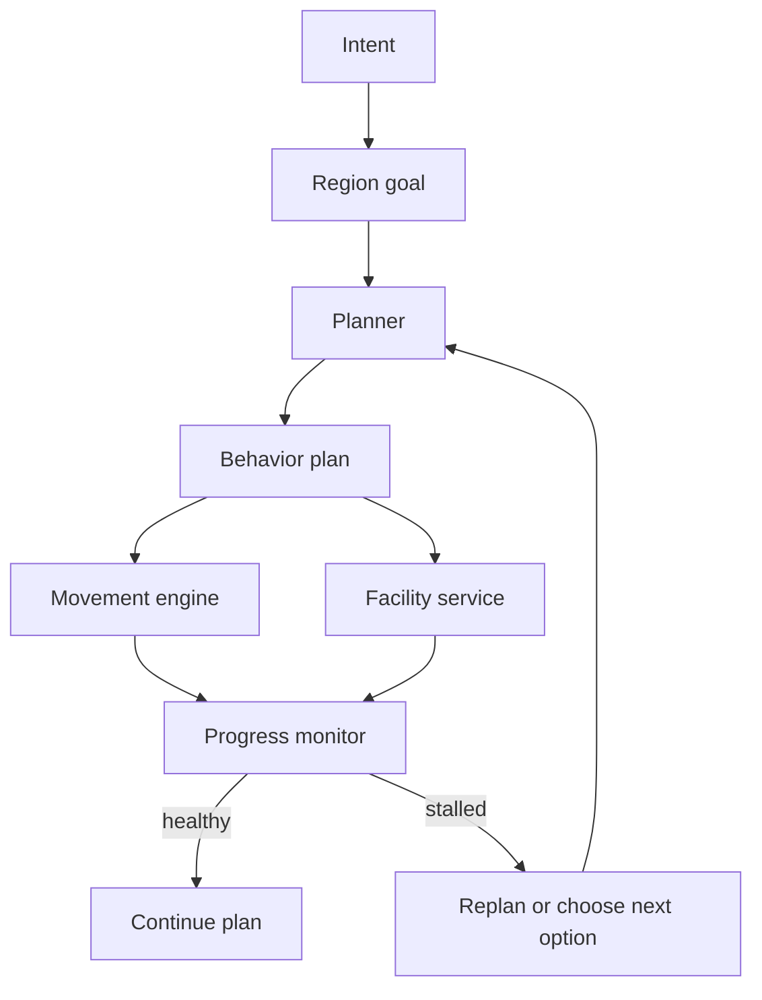
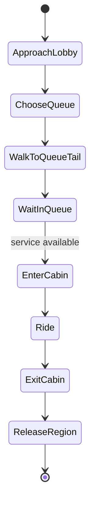
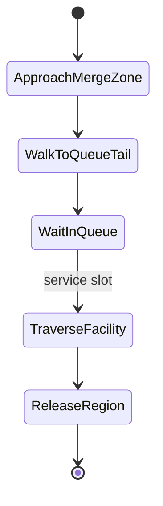
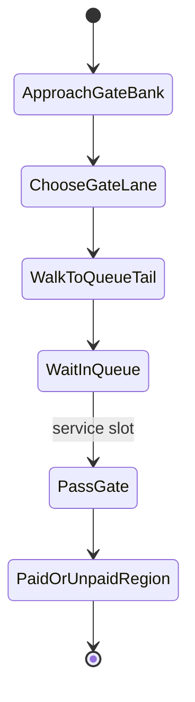

# Passenger Behavior Model

This document is the behavior contract for station simulation work. It keeps
passenger intent separate from the facility and queue mechanics needed to
realize that intent.

## Core Principle

A passenger goal is always region-to-region.

Examples:

- entrance region -> train interior
- train door region -> station exit region
- train door region -> transfer platform region
- platform region -> train interior

The passenger should not be born with a hand-authored sequence of waypoints.
Waypoints, queues, portals, and service stages are planner outputs derived from
the station graph and process model.

## Behavior Layers



### Intent

Intent explains why the passenger exists:

- `enter_and_board`
- `exit_station`
- `transfer`

Intent does not prescribe the exact facility sequence.

### Region Goal

Region goals define source and destination areas:

- `unpaid_concourse` -> `platform:line:direction`
- `train_door:line:direction` -> `station_exit`
- `platform:line_a` -> `platform:line_b`

The planner converts this into a route through the station graph.

### Behavior Plan

A behavior plan is a sequence of typed actions:

- `walk_to_region`
- `choose_facility`
- `walk_to_queue_tail`
- `join_queue`
- `wait_in_queue`
- `use_facility`
- `release_to_region`
- `board_train`
- `depart`

The important rule is that the target of walking is a region or queue capture
area, not an arbitrary decorative point.

## Facility Decomposition

Facilities are portals with service semantics.

Example: elevator



Example: escalator or stair



Example: gate portal



## Queue Semantics

Queue behavior has three distinct concepts:

- `targeting`: the passenger is approaching the queue capture area.
- `virtual_queue`: the passenger reached a valid queue capture area and has an
  ordered service token even if the pedestrian engine did not enqueue them.
- `enqueued`: the native pedestrian engine owns the queue order.

Service may release either native `enqueued` agents or audited `virtual_queue`
agents. Both must be visible in debug output.

Agents should not be switched into a queue stage from far away. A queue stage is
reachable only when a nearby queue slot or queue capture area is visible through
walkable geometry.

## Progress Monitor

Every active passenger needs progress checks:

- distance advanced since the last monitor sample,
- time spent in the same stage,
- distance to current region or queue capture area,
- queue wait time after joining a queue,
- service availability for the selected facility.

The monitor must distinguish three cases:

- blocked before queue capture,
- waiting correctly in queue,
- stalled after service or release.

## Replanning

Replanning is allowed, but it must be explicit and audited.

Triggers:

- no progress for a configured time window,
- selected facility queue exceeds a wait threshold,
- selected facility becomes unavailable,
- route to the next region is no longer geometry-reachable.

Allowed replans:

- choose the next best facility of the same stage,
- route to another queue capture zone in the same gate or escalator bank,
- choose another vertical transport if the passenger preference permits it,
- choose another boarding door on the same platform.

Disallowed replans:

- teleporting to a queue stage from outside the capture area,
- crossing a fare barrier without a gate service action,
- switching line or direction unless the intent permits transfer replanning,
- silently suppressing the failed route.

Facility alternatives should be ranked by generalized cost:

```text
cost = walking_time + queue_delay + facility_penalty + congestion_penalty
```

Random tie-breaking is allowed only after cost ranking.

## Implementation Target

The long-term API should look like:

```python
RegionGoal(
    origin="entrance:right",
    destination="platform:line_2:down",
    intent="enter_and_board",
)

BehaviorPlanner.plan(goal, station_graph, process_model)
```

The planner should return typed actions, not hand-authored waypoint chains.
Visual demo waypoints are acceptable only as compiled geometry from regions,
portals, queue layouts, and corridor bands.

## Debug Surface

Each frame or debug sample should expose:

- passenger intent,
- current region,
- current action type,
- target region or facility,
- queue mode: `targeting`, `virtual_queue`, or `enqueued`,
- current facility candidate set,
- progress age,
- last replan reason.

This makes stuck passengers explainable by behavior state instead of by visual
position alone.

Current implementation:

- `behavior.py` defines the shared `RegionGoal`, `BehaviorStatus`, and
  `BehaviorActionKind` vocabulary.
- `MetroStationModel.snapshot()` emits a `behavior` object for every live
  passenger.
- `progress_monitor.py` tracks no-progress windows and emits audited route or
  same-stage facility replans.
- `facility_choice.py` ranks alternatives by generalized cost and samples them
  with a multinomial logit choice model instead of pushing everyone to the
  single shortest queue.
- `visual_demo/generate_jps_tracks.py` emits `behavior_action`, `queue_mode`,
  `region_goal`, `current_region`, and `target_region` in each sampled agent
  record and stuck-window report.
