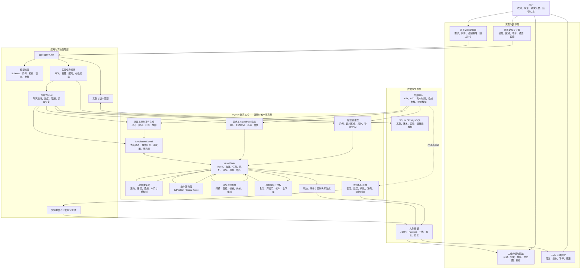

# 凯撒治国计划：系统架构提案

- 提交日期：2026-08-02
- 提交者称谓：凯撒
- 资料性质：用户提交的行政/技术架构提案
- 法律地位：非法律、非校准方案、非已实现事实；仅作为文献评价与立法研究对象

```mermaid
flowchart TB
    U["用户<br/>教师、学生、研究人员、运营人员"]

    subgraph UI["交互与展示层"]
        DESIGN["网页站型设计器<br/>楼层、区域、墙体、通道、设施"]
        EXP["网页实验配置器<br/>需求、列车、控制策略、随机种子"]
        DASH["二维分析与回放<br/>轨迹、密度、排队、热力图、指标"]
        UNITY["Unity 三维回放<br/>漫游、播放、暂停、倍速"]
    end

    subgraph APP["应用与实验管理层"]
        API["本地 HTTP API"]
        CASE["案例与版本管理"]
        VALID["模型校验<br/>Schema、几何、拓扑、语义、参数"]
        ORCH["实验任务编排<br/>单次、批量、配对、参数扫描"]
        WORKER["仿真 Worker<br/>隔离运行、进度、取消、异常恢复"]
        REPORT["实验报告与可复现包生成"]
    end

    subgraph SIM["Python 仿真核心——运行时唯一事实源"]
        COMPILE["站型编译器<br/>几何、语义区域、拓扑、导航空间"]
        DEMAND["需求与 AgentPlan 生成<br/>OD、到达时间、活动、属性"]
        INPUT_EVENT["场景与控制事件生成<br/>封闭、限流、引导、故障"]

        KERNEL["Simulation Kernel<br/>仿真时钟、事件队列、调度器、随机流"]
        WORLD["WorldState<br/>Agent、位置、任务、队列、设施、列车、拓扑"]

        DECISION["战术决策层<br/>活动、路径、设施、车门与重规划"]
        LOCOMOTION["操作运动层<br/>JuPedSim / Social Force"]
        FACILITY["设施过程引擎<br/>闸机、安检、楼梯、扶梯、电梯"]
        TRAIN["列车与站台过程<br/>到发、开关门、候车、上下车"]

        METRIC["在线指标引擎<br/>密度、延误、排队、冲突、清场时间"]
        SNAPSHOT["轨迹、事件与回放快照生成"]
    end

    subgraph DATA["数据与文件层"]
        SOURCE["外部输入<br/>OD、AFC、列车时刻、设施参数、观测数据"]
        DB["SQLite / PostgreSQL<br/>案例、版本、实验、运行元数据"]
        FILES["文件存储<br/>JSON、Parquet、回放、报告、日志"]
    end

    U --> DESIGN
    U --> EXP
    U --> DASH
    U --> UNITY

    DESIGN --> API
    EXP --> API
    API --> CASE
    API --> VALID
    API --> ORCH

    ORCH --> WORKER
    WORKER --> COMPILE
    WORKER --> DEMAND
    WORKER --> INPUT_EVENT
    WORKER --> KERNEL

    COMPILE --> WORLD
    DEMAND --> WORLD
    INPUT_EVENT --> KERNEL

    KERNEL <--> WORLD

    WORLD --> DECISION
    DECISION --> WORLD

    WORLD --> LOCOMOTION
    LOCOMOTION --> WORLD

    WORLD --> FACILITY
    FACILITY --> WORLD

    WORLD --> TRAIN
    TRAIN --> WORLD

    WORLD --> METRIC
    WORLD --> SNAPSHOT

    SOURCE --> COMPILE
    SOURCE --> DEMAND
    SOURCE --> INPUT_EVENT
    SOURCE -.校准与验证.-> METRIC

    CASE <--> DB
    ORCH <--> DB
    WORKER <--> DB

    METRIC --> REPORT
    METRIC --> FILES
    SNAPSHOT --> FILES
    REPORT --> FILES

    FILES --> DASH
    FILES --> UNITY
```
